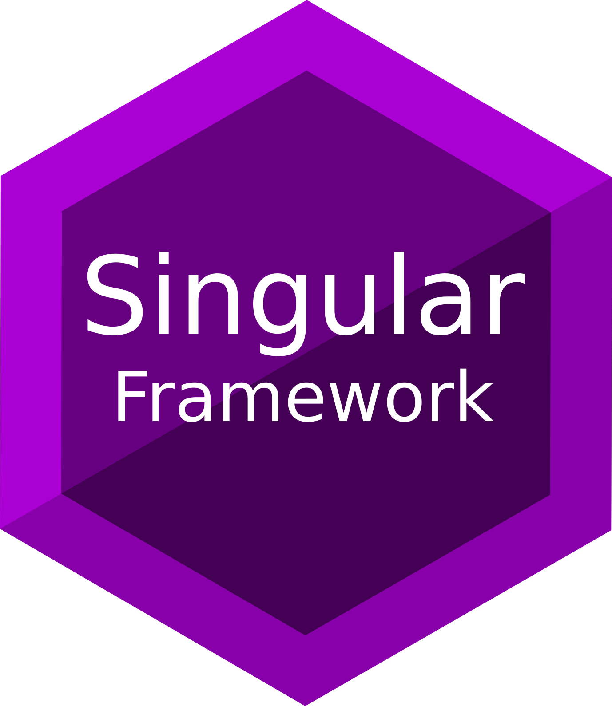
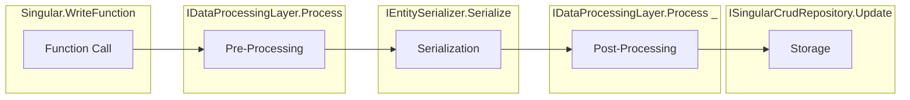
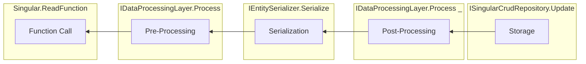

<hr>

# SingularFrameworkCore

**SingularFrameworkCore** is a simple generic C# library designed for handling the storage and management of singular objects. using the `Singular<I,O>` where I is the input (your model) and O is the output (the stored format). It's based on the CRUD principles for a simple API that you can easily use to create, read, update, and delete objects of a specific type, stored in a custom format, such as a string.

## Features

- **CRUD BASED**: Simple and intuitive API for Create, Read, Update, and Delete operations.
- **Generic Design**: Works with any type as long as the requirements are satisfied.

## Installation

The package is available on NuGet. To install it, use the following command:

```bash
Install-Package SingularFrameworkCore
```

Or, using the .NET CLI:

```bash
dotnet add package SingularFrameworkCore
```
## How it works ? (important!)
The library offers a generic pipeline for Storing a model into a target.
The Pipeline consists of 4 main phases  :

1- Pre-Processing 

2- Serialization

3- Post-Processing

4- Storage

> **Note:** The storage unit can be any target and does not have to be in disk, its just a "Target" and this target is a generic interface of type
 `SingularFrameworkCore.Repository.ISingularCrudRepository` or `SingularFrameworkCore.Repository.ISingularCrudAsyncRepository`

### The Input Pipeline :
The input pipeline is basically data going from your program to the storage, And for the case of the CRUD Api, Its The `Singular.Create(T)` and `Singular.Update(T)` functions.

**Figure 1**

### The Output Pipeline :
The output pipeline is basically data fetched from the storage to your program, In the case of CRUD only the `Singular.Read()` function goes through this pipeline.

**Figure 2**


> **Note:** The "Reverse" word in **Figure 2** means the inverse of the operation made during the processing in the input represented in **Figure 1**, so if during processing you made the operation `+3` to the data the reverse process must return the original data doing `-3` to reverse it.

> **Note:** put in mind that **Processing Layers** are just a list of Processing layers that are all "applied" in order from first to last and in reverse order when reading out , so each layer has a **single responsibility** of doing something and undoing the same thing.

> **Note:** For **Pre** and **Post** in the processing layers are **Pre-Serialization Processing Layers** and **Post-Serialization Processing Layers**

## Getting Started

### 1. Import the Library

Include the namespace in your C# project:

```csharp
using SingularFrameworkCore;
```

### 2. Create an Instance of `Singular<I, O>`
```csharp
public Singular(
        ISingularCrudRepository<O> repository,
        IEntitySerializer<I, O> serializer,
        List<IDataProcessorLayer<I>> preProcessors,
        List<IDataProcessorLayer<O>> postProcessors
    )
```
### Argumets : 
1- `ISingularCrudRepository<O> repository` is the `storage`

2- `IEntitySerializer<I, O> serializer` is the serialization unit from type`I` to `O`

3- `List<IDataProcessorLayer<I>> preProcessors` is a list of all Pre-Serialization processing layers.

4- `List<IDataProcessorLayer<O>> postProcessors` is a list of all Post-Serialization processing layers

Creating an instance of the `Singular` Would require fulfilling these parameters which do not have an internal implementation in this library, you could use any third-party integration , implement your own or check out some other integrations that are made.

### 3. Use it
Just as simple as that you can use it directly after completing the previous steps.

## Full Example :
a simple Repository for a file on the file system : 

```csharp
using System.IO;
using SingularFrameworkCore.Repository;

public class TextFileRepository : ISingularCrudRepository<string>
{
    public string Path { get; }

    public TextFileRepository(string path)
    {
        this.Path = path;
    }

    public async Task Create(string entity)
    {
        if (!File.Exists(this.Path))
        {
            File.Create(this.Path);
            await File.WriteAllTextAsync(this.Path, entity);
        }
        else
            throw new InvalidOperationException("File already exists");
    }

    public Task Delete()
    {
        if (File.Exists(this.Path))
            File.Delete(this.Path);
        return Task.CompletedTask;
    }

    public Task<string> Read()
    {
        return File.ReadAllTextAsync(this.Path);
    }

    public Task Update(string newEntity)
    {
        return File.WriteAllTextAsync(this.Path, newEntity);
    }
}
```
a simple Newtonsoft.Json based serializer
```csharp
using Newtonsoft.Json;
using Newtonsoft.Json.Linq;
using SingularFrameworkCore.Serialization;

class NewtonsoftJsonStringSerializer<T> : IEntitySerializer<T, string>
{
    public string Serialize(T entity)
    {
        return JObject.FromObject(entity!).ToString();
    }

    public T Deserialize(string json)
    {
        return JObject.Parse(json).ToObject<T>()!;
    }
}
```
A simple program using our implementations :
```csharp
using SingularFrameworkCore;

public class MyClass
{
    public string Name { get; set; }
    public int Age { get; set; }
}

public 

class Program
{
    static void Main()
    {
        // Create an instance of Singular for MyClass objects stored as strings
        var singular = new Singular<MyClass, string>(
            new TextFileRepository("test.json"), // Our Target Text File Storage
            new NewtonsoftJsonStringSerializer<MyClass>(), // Our Json string serializer
            new List<IDataProcessorLayer<MyClass>>(), // The Pre-Processor layers
            new List<IDataProcessorLayer<string>>() // The Post-Processor layers
        );

        // Create a new object
        var myObject = new MyClass { Name = "John", Age = 30 };
        singular.Create(myObject);

        // Read the object
        var retrievedObject = singular.Read();
        Console.WriteLine($"Name: {retrievedObject.Name}, Age: {retrievedObject.Age}");

        // Update the object
        retrievedObject.Age = 31;
        singular.Update(retrievedObject);

        // Delete the object
        singular.Delete();
    }
}
```


## Contributing

Contributions are welcome! Feel free to submit a pull request or open an issue for any bugs or feature requests.

### *PLEASE MAKE SURE TO ONLY PR TO `origin/development` BRANCH AND NOT `origin/master`*

> **Note:** I'm not actively updating the library because there is nothing to add in my mind, if you had a feature idea that you want to add, just open an issue, otherwise don't expect regular updates to the library.

> **Note:** **Please Make Sure That any feature idea, Contribution can be generified and does not require any dependencies**, trying to make this library an abstract definition to avoid coupling or dependency hell, and there will be multiple implementations using multiple methods in separate libraries.

If you'd like to contribute to the library writing an implementation for any of the interfaces, Please implement it in the Convention `Author.SingularFrameworkCore.Feature.YourImplementation'sNameSpace`

for example if we'd implement Newtonsoft.Json Serialization we could do :
`MohammadAyaad.SingularFrameworkCore.Serialization.Newtonsoft.Json` and under that namespace goes a `JsonSerializer`

## License

This project is licensed under the Apache License 2.0 License. See the [LICENSE](LICENSE) file for details.

## Feedback

If you have any questions, suggestions, or feedback, please open an issue on the [GitHub repository](https://github.com/MohammadAyaad/SingularFrameworkCore).

## Author
###  Made by [Mohammad Ayaad](https://github.com/MohammadAyaad) 

## Contributers
None