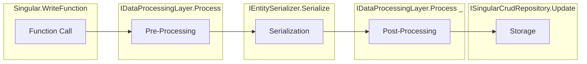
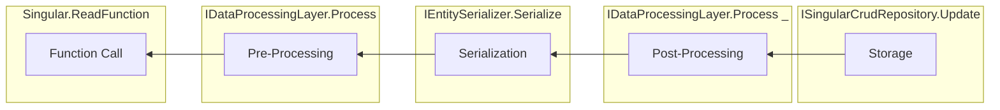

# SingularFrameworkCore

**SingularFrameworkCore** is a simple generic C# library designed for handling the storage and management of singular objects. using the `Singular<I,O>` where I is the input (your model) and O is the output (the stored format). It's based on the CRUD principles for a simple API that you can easily use to create, read, update, and delete objects of a specific type, stored in a custom format, such as a string.

## Features

- **CRUD BASED**: Simple and intuitive API for Create, Read, Update, and Delete operations.
- **Generic Design**: Works with any type as long as the requirements are satisfied.

## Installation

The package is available on NuGet. To install it, use the following command:

```bash
Install-Package SingularFrameworkCore
```

Or, using the .NET CLI:

```bash
dotnet add package SingularFrameworkCore
```
## How it works ? (important!)
The library offers a generic pipeline for Storing a model into a target.
The Pipeline consists of 4 main phases  :

1- Pre-Processing 

2- Serialization

3- Post-Processing

4- Storage

> **Note:** The storage unit can be any target and does not have to be in disk, its just a "Target" and this target is a generic interface of type
 `SingularFrameworkCore.Repository.ISingularCrudRepository` or `SingularFrameworkCore.Repository.ISingularCrudAsyncRepository`

### The Input Pipeline :
The input pipeline is basically data going from your program to the storage, And for the case of the CRUD Api, Its The `Singular.Create(T)` and `Singular.Update(T)` functions.

**Figure 1**

### The Output Pipeline :
The output pipeline is basically data fetched from the storage to your program, In the case of CRUD only the `Singular.Read()` function goes through this pipeline.

**Figure 2**


> **Note:** The "Reverse" word in **Figure 2** means the inverse of the operation made during the processing in the input represented in **Figure 1**, so if during processing you made the operation `+3` to the data the reverse process must return the original data doing `-3` to reverse it.

> **Note:** put in mind that **Processing Layers** are just a list of Processing layers that are all "applied" in order from first to last and in reverse order when reading out , so each layer has a **single responsibility** of doing something and undoing the same thing.

> **Note:** For **Pre** and **Post** in the processing layers are **Pre-Serialization Processing Layers** and **Post-Serialization Processing Layers**

## Getting Started

### 1. Import the Library

Include the namespace in your C# project:

```csharp
using SingularFrameworkCore;
```

### 2. Create an Instance of `Singular<I, O>`
```csharp
public Singular(
        ISingularCrudRepository<O> repository,
        IEntitySerializer<I, O> serializer,
        List<IDataProcessorLayer<I>> preProcessors,
        List<IDataProcessorLayer<O>> postProcessors
    )
```
### Argumets : 
1- `ISingularCrudRepository<O> repository` is the `storage`
2- `IEntitySerializer<I, O> serializer` is the serialization unit from type`I` to `O`
3- `List<IDataProcessorLayer<I>> preProcessors` is a list of all Pre-Serialization Processing layers.

### 3. Perform CRUD Operations

#### **Create**
Create and store an object.

```csharp
singular.Create(myObject);
```

#### **Read**
Retrieve the stored object.

```csharp
var myObject = singular.Read();
```

#### **Update**
Update the stored object.

```csharp
singular.Update(updatedObject);
```

#### **Delete**
Remove the stored object.

```csharp
singular.Delete();
```

### Example Usage

Here is a complete example of how to use the `Singular<T, U>` class:

```csharp
using SingularFrameworkCore;

public class MyClass
{
    public string Name { get; set; }
    public int Age { get; set; }
}

class Program
{
    static void Main()
    {
        // Create an instance of Singular for MyClass objects stored as strings
        var singular = new Singular<MyClass, string>();

        // Create a new object
        var myObject = new MyClass { Name = "John", Age = 30 };
        singular.Create(myObject);

        // Read the object
        var retrievedObject = singular.Read();
        Console.WriteLine($"Name: {retrievedObject.Name}, Age: {retrievedObject.Age}");

        // Update the object
        retrievedObject.Age = 31;
        singular.Update(retrievedObject);

        // Delete the object
        singular.Delete();
    }
}
```

## Contributing

Contributions are welcome! Feel free to submit a pull request or open an issue for any bugs or feature requests.

## License

This project is licensed under the MIT License. See the [LICENSE](LICENSE) file for details.

## Feedback

If you have any questions, suggestions, or feedback, please open an issue on the [GitHub repository](https://github.com/yourusername/SingularFrameworkCore).
